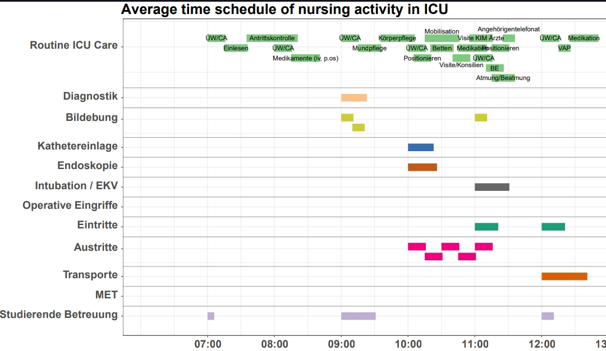

# R-timeline-chart
*R code to plot a timeline chart to monitor business/work interventions (activities) and workload spread, based on the "vistime" R package.*

This code is suited for cases where there are scheduled times and possible min/max/average durations of interventions, for which cumulative timeline charts are desired.

The input is an Excel datasheet with columns specifying:
1. Category of activity (for grouping related activities and graphically separating the categories).
2. Intervention names.
3. Intervention abbreviation labels (for cleaner graphs).
4. A datetime column specifying the scheduled starting time of each intervention.
5. Average intervation duration time.
6. Max intervention duration time.
7. Min intervention duration time.

An example Excel datasheet is provided. No need to completely fill in the "abbreviations" label as missing values will be filled with corresponding row's intervention field.

Chart output example:

